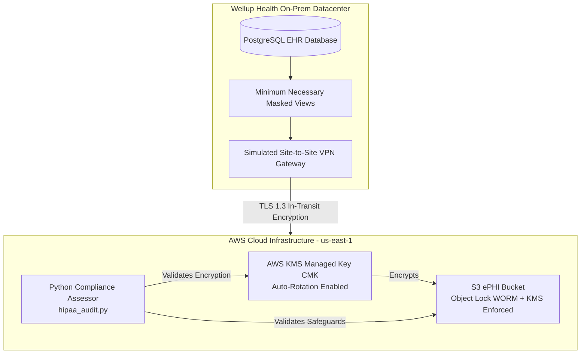

# HIPAA Hybrid Healthcare Compliance & Audit Framework

**Organisation:** Wellup Health System
**Framework Baseline:** HIPAA Security Rule (45 CFR Part 160 & Part 164) & Privacy Rule (§ 164.502 / § 164.512)

---

## Executive Summary

Wellup Health System operates a hybrid healthcare model linking on-premises Electronic Health Record (EHR) databases with AWS cloud infrastructure for medical record storage, telemetry, and analytics.

This repository demonstrates an end-to-end **Security Compliance Assessment Workflow**:

1. **Infrastructure as Code (IaC):** Automated deployment of technical safeguards enforcing encryption, access control, and data immutability.
2. **Privacy Safeguard Engineering:** Implementation of the HIPAA *Minimum Necessary Rule* (§ 164.502(b)).
3. **Automated Evidence Collection:** Python audit engine verifying running cloud resources against HIPAA Technical Safeguards.
4. **Assessor Deliverables:** Security Risk Analysis (SRA), Control Traceability Matrix, and Corrective Action Plan (CAP).

---

## Repository Structure

```text
hipaa-hybrid-healthcare-audit-framework/
├── README.md                           # Executive summary & Assessor report
├── .gitignore                          # Excludes state files & evidence logs
├── compliance_framework/
│   ├── hipaa_audit.py                  # Automated Python compliance scanner
│   └── controls_mapping.csv            # HIPAA Control Traceability Matrix
└── infrastructure/                     # Terraform IaC
    ├── main.tf                         # Root module orchestrator
    ├── variables.tf                    # Environment configuration
    ├── outputs.tf                      # Exported resource attributes
    └── modules/
        ├── kms/
        │   └── main.tf                 # KMS CMK key rotation module
        └── ephi_storage/
            └── main.tf                 # S3 ePHI WORM & encryption module
```

---

## System Architecture



---

## HIPAA Control Traceability Matrix

| HIPAA Section | Safeguard Title | Control Type | Technical Implementation | Audit Verification |
|---|---|---|---|---|
| § 164.312(a)(1) | Access Control | Technical | S3 Block Public Access & Private Subnets | COMPLIANT |
| § 164.312(a)(2)(iv) | Encryption at Rest | Technical | AWS KMS CMK with key rotation enabled | COMPLIANT |
| § 164.312(c)(1) | Data Integrity | Technical | S3 Object Lock (WORM) retention | COMPLIANT |
| § 164.308(a)(7) | Contingency Plan | Administrative | S3 Bucket Versioning for disaster recovery | COMPLIANT |
| § 164.502(b) | Minimum Necessary | Privacy | Role-based data masking views on EHR database | COMPLIANT |