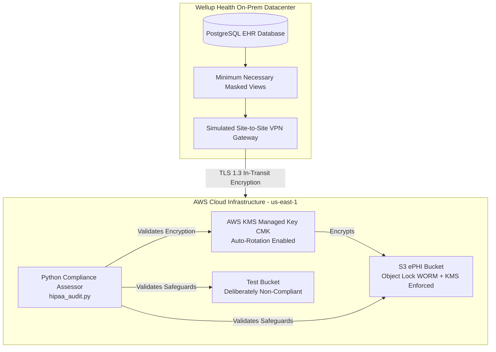

# HIPAA Hybrid Healthcare Compliance & Audit Framework

### Wellup Health System  
### HIPAA Security Rule (45 CFR Part 160 & Part 164) & Privacy Rule (§ 164.502 / § 164.512)

---

## Disclaimer

This is a portfolio demonstration project. Wellup Health System is fictional, and all AWS
resources referenced here were deployed in a personal lab AWS account. Nothing in this
repository constitutes a real HIPAA compliance audit, certification, or legal attestation.

---

## Executive Summary

Wellup Health System operates a hybrid healthcare model linking on-premises Electronic Health
Record (EHR) databases with AWS cloud infrastructure for medical record storage, telemetry,
and analytics.

This repository demonstrates an end-to-end **Security Compliance Assessment Workflow**:

1. **Infrastructure as Code (IaC):** Automated deployment of technical safeguards enforcing encryption, access control, and data immutability.
2. **Privacy Safeguard Engineering:** Implementation of the HIPAA *Minimum Necessary Rule* (§ 164.502(b)).
3. **Automated Evidence Collection:** Python audit engine verifying running cloud resources against HIPAA Technical Safeguards, including a deliberately misconfigured test resource used to validate detection.
4. **Assessor Deliverables:** Control Traceability Matrix, real audit evidence, and a Corrective Action Plan (CAP).

---

## Repository Structure

```text
hipaa-hybrid-healthcare-audit-framework/
├── README.md                              # Executive summary & Assessor report
├── CORRECTIVE_ACTION_PLAN.md              # Open findings and remediation tracking
├── .gitignore
├── compliance_framework/
│   ├── hipaa_audit.py                     # Automated Python compliance scanner
│   ├── controls_mapping.csv               # HIPAA Control Traceability Matrix
│   ├── evidence/
│   │   └── hipaa_audit_report.csv         # Real scan output (compliant + non-compliant)
│   └── docs/
│       └── minimum-necessary-review.md    # Manual review for § 164.502(b)
└── infrastructure/                        # Terraform IaC
    ├── main.tf
    ├── variables.tf
    ├── outputs.tf
    └── modules/
        ├── kms/
        │   └── main.tf                     # KMS CMK, key rotation enabled
        ├── ephi_storage/
        │   └── main.tf                     # Compliant S3 ePHI bucket
        └── ephi_storage_noncompliant/
            └── main.tf                     # Deliberately misconfigured test bucket
```

---

## System Architecture



---

## HIPAA Control Traceability Matrix

| HIPAA Section | Safeguard Title | Control Type | Technical Implementation | Verification Method |
|---|---|---|---|---|
| § 164.312(a)(1) | Access Control | Technical | S3 Block Public Access & Private Subnets | Automated (hipaa_audit.py) |
| § 164.312(a)(2)(iv) | Encryption at Rest | Technical | AWS KMS CMK Server-Side Encryption | Automated (hipaa_audit.py) |
| § 164.312(a)(2)(iv) | KMS Key Rotation | Technical | AWS KMS CMK Automatic Key Rotation | Automated (hipaa_audit.py) |
| § 164.312(c)(1) | Data Integrity | Technical | S3 Object Lock (WORM) retention | Automated (hipaa_audit.py) |
| § 164.308(a)(7) | Contingency Plan | Administrative | S3 Bucket Versioning | Automated (hipaa_audit.py) |
| § 164.502(b) | Minimum Necessary | Privacy | Role-based masking views on EHR database | Manual (see `docs/minimum-necessary-review.md`) |

---

## Audit Evidence

Live evidence is stored at `compliance_framework/evidence/hipaa_audit_report.csv`, generated by
running `hipaa_audit.py` against the deployed AWS environment. The evidence set intentionally
includes a **known non-compliant test resource** (`ephi_storage_noncompliant` module) to
validate that the scanner correctly detects missing controls, rather than reporting compliant-only
results for every resource.

See `CORRECTIVE_ACTION_PLAN.md` for tracking of the resulting finding through to remediation.